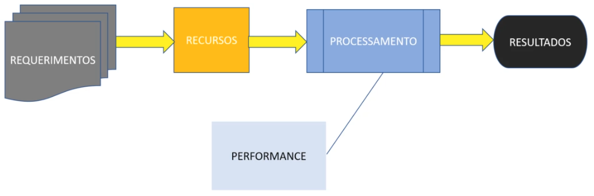
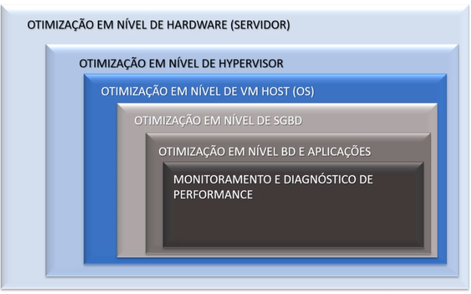

# Udemy - Performance Total no SQL Server

### **Instrutor**: Vínicius Nogueira
### **Linkedin**: [Link para página Perfil](https://www.linkedin.com/in/viniciusnogueira/)
### **Página curso na Udemy**: [Link para página do curso](https://www.udemy.com/course/performance-total-no-sql-server/learn/lecture/26043050?start=0#overview)
### Pasta Google Drive Treinamento: [Link para pasta do curso](https://drive.google.com/drive/folders/1DzaUlE7JZ8Sjoir8pWCLPQak6zVjqMDm?usp=drive_link)
### **Início**: 03/09/2024
### **Término**: 

---

## Introdução

- Tarefas devem ser executadas dentro de um tempo aceitável
- Empresas menores, performance normalmente é colocada de lado, problemas são observados em geral quando já está em produção
- É feito um bom trabalho de análise de requisitos, desenvolvimento, feito testes, porém sem levar em conta cenários realistas
- Solução de problemas de performance normalmente ocorre quando o sistema já está em uso, gerando muitas vezes indisponibilidade
- Normalmente estes problemas são decorrentes de questões de design, estrutura

### SQL Server: Performance

No ciclo comum de desenvolvimento de uma aplicação a Performante normalmente é observada na fase de Processamento, onde são feitos testes, QA estressa a aplicação e com base nos resultados são feitas avaliações de Performance, mas isto deveria ser visto ainda na fase de Recursos

Não basta aumentarmos os Recursos de máquina e acharmos que isto irá resolver os problemas de performance, precisamos sim, identificar os gargalos de nosso sistema

O que costuma acontecer:

- Problemas de Performance e Procrastinação andam de mãos dadas
- Ocorrem de forma lenta e gradativa, aumentando o nível de insatisfação dos usuários e diminuindo a produtividade

Problemas de Performance são os mais comuns e duradouros em sistemas de qualquer empresa, pois na maioria dos casos ele não impede a utilização total do sistema, fazendo com que as pessoas demorem mais para reagir a este problema.

Iniciaremos nossa jornada respondendo a estas questões:

1. _**Onde**_ o Servidor de Banco de Dados está instalado
1. _**Como**_ o Servidor de Banco de Dados está instalado
1. _**Como**_ o Servidor de Banco de Dados é acessado pelos usuários/aplicações
1. _**Como**_ o Servidor de Banco de Dados é Monitorado e Mantido

Passaremos pelos seguintes níveis de análise:

- Otimização em nível de Hardware (Servidor)
- Otimização em nível de Hypervisor
- Otimização em nível de VM Host (OS)
- Otimização em nível de SGBD
- Otimização em nível BD e Aplicações
- Monitoramento e Diagnóstico de Performance

