# Udemy - Performance Total no SQL Server

### **Instrutor**: Vínicius Nogueira
### **Linkedin**: [Link para página Perfil](https://www.linkedin.com/in/viniciusnogueira/)
### **Página curso na Udemy**: [Link para página do curso](https://www.udemy.com/course/performance-total-no-sql-server/learn/lecture/26043050?start=0#overview)
### Pasta Google Drive Treinamento: [Link para pasta do curso](https://drive.google.com/drive/folders/1DzaUlE7JZ8Sjoir8pWCLPQak6zVjqMDm?usp=drive_link)
### **Início**: 03/09/2024
### **Término**: 

---

## Seção 1: Introdução: Visão Geral do Curso Performance Total no SQL Server

### Introdução

- Tarefas devem ser executadas dentro de um tempo aceitável
- Empresas menores, performance normalmente é colocada de lado, problemas são observados em geral quando já está em produção
- É feito um bom trabalho de análise de requisitos, desenvolvimento, feito testes, porém sem levar em conta cenários realistas
- Solução de problemas de performance normalmente ocorre quando o sistema já está em uso, gerando muitas vezes indisponibilidade
- Normalmente estes problemas são decorrentes de questões de design, estrutura

### SQL Server: Performance

No ciclo comum de desenvolvimento de uma aplicação a Performante normalmente é observada na fase de Processamento, onde são feitos testes, QA estressa a aplicação e com base nos resultados são feitas avaliações de Performance, mas isto deveria ser visto ainda na fase de Recursos.


Não basta aumentarmos os Recursos de máquina e acharmos que isto irá resolver os problemas de performance, precisamos sim, identificar os gargalos de nosso sistema.

O que costuma acontecer:

- Problemas de Performance e Procrastinação andam de mãos dadas
- Ocorrem de forma lenta e gradativa, aumentando o nível de insatisfação dos usuários e diminuindo a produtividade

Problemas de Performance são os mais comuns e duradouros em sistemas de qualquer empresa, pois na maioria dos casos ele não impede a utilização total do sistema, fazendo com que as pessoas demorem mais para reagir a este problema.

Iniciaremos nossa jornada respondendo a estas questões:

1. _**Onde**_ o Servidor de Banco de Dados está instalado
1. _**Como**_ o Servidor de Banco de Dados está instalado
1. _**Como**_ o Servidor de Banco de Dados é acessado pelos usuários/aplicações
1. _**Como**_ o Servidor de Banco de Dados é Monitorado e Mantido

Passaremos pelos seguintes níveis de análise:

- Otimização em nível de Hardware (Servidor)
- Otimização em nível de Hypervisor
- Otimização em nível de VM Host (OS)
- Otimização em nível de SGBD
- Otimização em nível BD e Aplicações
- Monitoramento e Diagnóstico de Performance


---

## Seção 2: Preparação do Ambiente para o Curso Performance Total no SQL Server

### Preparação do Laboratório do Treinamento

Para nosso Laboratório faremos uso de máquina Virtual e para tanto podemos escolher entre as seguintes opções:

1. vmware
    - [Link para página de Download](https://access.broadcom.com/default/ui/v1/signin/)
1. VirtualBox
    - [Link para página de Download](https://www.virtualbox.org/wiki/Downloads)
1. Vagrant
    - [Link para página de Download](https://developer.hashicorp.com/vagrant/install)

Para o servidor onde o SQL Server irá rodar, utilizaremos o Windows Server 2019 Evaluation Edition (ISO)

- [Link para página de Download](https://info.microsoft.com/ww-landing-windows-server-2019.html?lcid=pt-BR)

Para o servidor SQL Server, utilizaremos:

- SQL Server 2019 Developer Edition
    - [Link para página de Download](https://info.microsoft.com/ww-landing-sql-server-2019.html?lcid=pt-BR)
- SQL Server Management Studio (SSMS)
    - [Link para página de Download](https://learn.microsoft.com/pt-br/sql/ssms/download-sql-server-management-studio-ssms?view=sql-server-ver15)
- Banco de Dados de Exemplo (AdventureWorks sample database)
    - [Link para página de Downloads](https://github.com/Microsoft/sql-server-samples/releases/tag/wide-world-importers-v1.0)
        - _Escolha por WideWorldImporters-Full.bak_

### Configurando a máquina Virtual

Criar a máquina Virtual com as seguintes características:

- Nome: SQL-WIN-01
- Local do arquivo: C:\Users\carlo\VirtualBox VMs
- Tipo: Microsoft Windows
- Versão: Windows 2019 (64-bit)
- Hardware:
    - Memória Base = 3.0 GB
    - HD = 30 GB

Instalar Windows Server com as seguintes características:

- Language to install: English (United States)
- Time and currency format: English (United States)
- Keyboard or input method: US
- Operating system: Windows Server 2019 Standard Evaluation (Desktop Experience)
- Which type of installation do you want: Custom: Install Windows only (advanced)
- Customize settings:
    - User name: Administrator
    - Password: Minh@Senh@123

Pós instalação Windows Server:

- Adicionar VBoxWindowsGuestAdditions
- Ajustar Configurações de Pastas Compartilhadas
- Executar Windows Update
- Ajustar configurações Regionais (Data & Hora)
- Ajustar Configurações de Rede
    - VirtualBox Rede: Placa de Rede em modo Bridge
    - Windows Server TCP/IPv4:
        - IP address: 192.168.0.133
        - Subnet mask: 255.255.255.0
        - Default gateway: 192.168.0.1
        - Preferred DNS server: 192.168.0.1
        - Alternate DNS server: 8.8.8.8
- Habilitar Remote Desktop
    1. Inicie o Server Manager
    1. Navegue até Local Server
    1. Em Properties, clique em Remote Desktop e altere para Enable
        
- Alterar porta padrão do Remote Desktop
    1. Inicie o Editor do Registro. (Digite regedit na caixa de pesquisa.)
    1. Navegue até a seguinte subchave do registro: HKEY_LOCAL_MACHINE\System\CurrentControlSet\Control\Terminal Server\WinStations\RDP-Tcp
    1. Localize PortNumber
    1. Clique em Editar > Modificar e, depois, em Decimal.
    1. Digite o número da porta (53389) e, em seguida, clique em OK.
    1. Feche o editor do registro e reinicie o computador.
    1. Adicionar regra de Firewall
        - TCP = Remote Desktop - MyMode (TCP-In)
        - UDP = Remote Desktop - MyMode (UDP-In)
    - [Link para documentação](https://learn.microsoft.com/pt-br/windows-server/remote/remote-desktop-services/clients/change-listening-port)

**Dores**: _Embora no Laboratório proposto não fosse pedido para fixar o IP da VM, achei que seria razoável faze-lo, entretanto isso me custou algumas horas de trabalho para realizar sua configuração, tudo porque não me atentei que o IP que havia definido já estava em uso, ainda que no teste previo de ping ele não estivesse respondendo. Fica a recomendação para fazer um planejamento e esboço prévio, para evitar este tipo de situação._

Instalar SQL Server com as seguintes características:

- Specify SQL Server media download target location
    - Media Location = C:\Softwares_Arquivos\SQL2019
- Specify the edition of SQL Server 2019 to install = Developer
- Features Selection:
    - Database Engine Services
    - SQL Server Replication
    - Integration Services
    - Client Tools Connectivity
        - Client Tools SDK
- Features Rules:
    - Instance root directory = C:\Program Files\Microsoft SQL Server\
    - Shared feature directory = C:\Program Files\Microsoft SQL Server\
    - Shared feature directory (x86) = C:\Program Files (x86)\Microsoft SQL Server\
- Instance Configuration:
    - Named instance = SQL2019DEMO
    - Instance ID = SQL2019DEMO
- Server Configuration:
    - Service Accounts = Ficou com as opções Default
    - Collation = Ficou com as opções Default
- Database Engine Configuration:
    - Server Configuration
        - Authentication Mode = Mixed Mode (SQL Server authentication and Windows authentication)
        - Add Current User = SQL-WIN-01\Administrator
        - Data Directories
            - Ficou com as opções Default
        - TempDB
            - Ficou com as opções Default
        - MaxDOP
            - Ficou com as opções Default
        - Memory
            - Ficou com as opções Default
        - FILESTREAM
            - Ficou com as opções Default

---

## Seção 3: Onde o Serviço do Banco de Dados está instalado

### Conceitos essenciais sobre Máquinas Virtuais e Físicas

### Onde o SGBD está instalado?

Identificar Recursos do Servidor em termos de hardware
- CPU
- Memória
- Disco
- Rede

Devemos ter cuidado com limitações de certas versões de Sistema Operacional
- CPU
- Memória
- Disco
- Rede
- Suporte Técnico

Qual o tipo de Servidor no qual o SGBD está instalado:
- Virtual
- Físico (Bare Metal)

### Visão geral da Arquitetura de Virtualização


Uma forma de sabermos se nosso Servidor está rodando em uma máquina virtual é executarmos o "_**System Information**_" (ambiente Windows), ele traz entre outras informações importantes, qual o fabricante do Hardware. 

Neste exemplo podemos observar que trata-se de uma máquina virtual.


Já neste outro exemplo, observamos tratar-se de uma máquina física.


De maneira geral a Performance em servidores físicos (Bare Metal), tendem a ser melhor que em VMs

- Sem necessidade da camada do hipervisor
- Sem compartilhamento de recursos
- Recursos de sub-sistemas são acessados diretamente

As soluções de Bare Metal e ambientes virtualizados também são encontrados em serviços de Nuvem
- AWS - Amazon
- Azure - Microsoft
- GCP - Google
- OCI - Oracle

Tornando-se importante conversar com estes fornecedores sobre as caracteristicas do serviço fornecido (ex. a máquina é exclusiva para sua aplicação ou compartilhada)

### Tipos de Hypervisor

Os hipervisores tipo 1 e tipo 2 são softwares usados para executar uma ou mais máquinas virtuais (VMs) em uma única máquina física. A máquina virtual é uma cópia digital de uma máquina física. É um ambiente de computação isolado que os usuários utilizam de maneira completamente independente do hardware subjacente. O hipervisor é a tecnologia que torna isso possível. Ele gerencia e aloca recursos físicos para VMs e se comunica com o hardware subjacente em segundo plano. 

_**O hipervisor tipo 1 fica em cima do servidor bare metal e tem acesso direto aos recursos de hardware. Por isso, o hipervisor tipo 1 também é conhecido como hipervisor bare metal. Por sua vez, o hipervisor tipo 2 é uma aplicação instalada no sistema operacional host. Ele também é conhecido como hipervisor hospedado ou integrado.**_

- [Link para maiores detalhes sobre as diferenças e conceitos](https://aws.amazon.com/pt/compare/the-difference-between-type-1-and-type-2-hypervisors/#:~:text=O%20hipervisor%20tipo%201%20fica%20em%20cima%20do,tamb%C3%A9m%20%C3%A9%20conhecido%20como%20hipervisor%20hospedado%20ou%20integrado)


---

## CPU Física e Virtual: Como identificar se a configuração está otimizada

Sub-sistemas de maior impacto na performance:

### CPU

**Arquitetura UMA (Uniform Memory Access)**


Nesta arquitetura todas as CUPs compartilham o mesmo bloco de memória, gerando um gargalo, ou seja, mesmo adicionando mais CPU eu ainda terei todas compartilhando da mesma memória.

**Arquitetura NUMA (Non-Uniform Memory Access)**


A arquitetura **NUMA (Non-Uniform Memory Access)** é um design de memória usado em sistemas multiprocessadores. Nela, a memória é dividida entre diferentes nós, cada um com seus próprios processadores e memória local. Isso significa que o tempo de acesso à memória pode variar dependendo de qual nó está acessando a memória.

Em resumo, a NUMA melhora a performance ao permitir que os processadores acessem a memória local mais rapidamente, reduzindo a latência e aumentando a eficiência do sistema.

**Arquitetura Virtual NUMA (vNUMA)**

A arquitetura **vNUMA (Virtual Non-Uniform Memory Access)** é uma extensão da arquitetura NUMA (Non-Uniform Memory Access) aplicada em ambientes virtualizados. Em um sistema NUMA, a memória é dividida entre diferentes nós, cada um com seus próprios processadores e memória local, o que melhora a performance ao reduzir a latência de acesso à memória.

No contexto de virtualização, o **vNUMA** replica essa estrutura para máquinas virtuais (VMs). Quando uma VM é configurada com mais vCPUs do que um único nó físico NUMA pode suportar, o hypervisor (como o VMware vSphere) cria uma topologia vNUMA. Isso permite que a VM se beneficie das mesmas vantagens de performance da arquitetura NUMA física, distribuindo a carga de trabalho de forma eficiente entre os nós físicos.

Em resumo, o vNUMA ajuda a otimizar a performance de VMs em servidores com múltiplos nós NUMA, garantindo que a alocação de memória e CPU seja feita de maneira eficiente.

**Recomendações Gerais**

- Alocar a VM numa mesma NUMA sempre que possível
- Virtual NUMA (vNUMA) e Dynamic Memory não podem ser utilizados ao mesmo tempo no Hyper-V
- **"CPU Hot Add" e "Memory Hot Add"** são recursos que permitem adicionar CPUs e memória a uma máquina virtual sem precisar desligá-la. Isso é extremamente útil para ajustar recursos dinamicamente conforme a demanda. No entanto, é importante ter cuidado ao usar esses recursos, especialmente em ambientes que utilizam SQL Server, por alguns motivos:

    1. **vNUMA**: Quando você adiciona CPUs ou memória a uma VM em execução, a topologia vNUMA pode ser alterada. Isso pode levar a uma redistribuição dos recursos de forma que a VM não aproveite mais os benefícios de performance da arquitetura NUMA original. A configuração inicial de vNUMA é feita no momento da inicialização da VM, e mudanças dinâmicas podem não ser refletidas corretamente.

    2. **Soft-NUMA**: Similarmente, o soft-NUMA, que é configurado automaticamente pelo SQL Server para otimizar a alocação de recursos, pode não se ajustar corretamente às mudanças dinâmicas de hardware. Isso pode resultar em uma subutilização dos recursos ou em uma performance subótima.

    Portanto, ao utilizar "CPU Hot Add" e "Memory Hot Add", é crucial monitorar e, se necessário, ajustar manualmente as configurações de NUMA e soft-NUMA para garantir que o SQL Server continue a operar de maneira eficiente.

**Exercício: Como verificar os nodes NUMA e soft-NUMA no Servidor**

- **NUMA** (Via SQL Server Management Studio)


- **soft-NUMA** (Via procedure sp_configure)


**Hyper-threading**


É um recurso de hardware que permite rodar 2 threads num mesmo core físico, fazendo com que tarefas sejam executadas em paralelo.
- Permite 1 CPU core operar 2 threads de uma vez, mas não dobra a performance da CPU
- Aumento de ganho de performance em torno de 25% - 30%

## Lições Aprendidas

> *"Até aqui, vimos que a otimização do SQL Server deve ser planejada desde a fase de design, evitando problemas em produção. Recursos de hardware, como CPU e memória, devem ser ajustados com cautela, especialmente em ambientes virtualizados, considerando fatores como NUMA e soft-NUMA. O uso de Hyper-threading pode melhorar a performance, mas com ganhos limitados, em torno de  25% a 30%. Monitorar o servidor regularmente e ajustar seus recursos deve ser uma prática contínua. Ferramentas como o SQL Server Profiler e o Query Store são essenciais para identificar e solucionar problemas de performance".*

---

## CPU HyperThreading: Turbinando meu SQL Server

### CPU Overcommit

- Ocorre quando tem mais vCPUs rodando no host do que o número de cores físicos presentes
- Tente manter o número de vCPUs não maior do que o número de cores físicos no host

**Exercício: Como verificar se hyperthreading está habilitado**

- Abra um prompt de comando como administrador e digite:

```
Wmic CPU Get NumberOfCores, NumberOfLogicalProcessors /Format:List
```

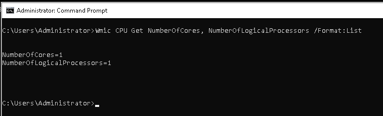

Para habilitar o hyperthreading

- BIOS
- Camada do Hypervisor

## Arquitetura de Memória Física e Virtual otimizada para melhor Performance

Sub-sistemas de maior impacto na performance
- Memória

**Arquitetura de Memória**

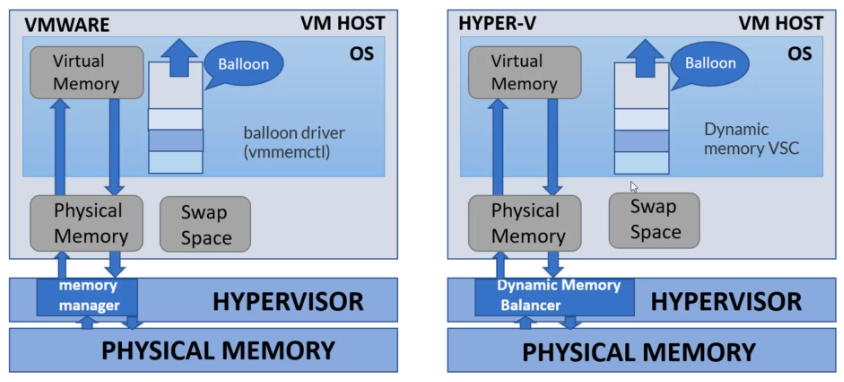

Problemas comuns relacionados a Memória Virtual
- Memory swapping: OS utiliza o arquivo de swap na falta de memória física
- Memory balloning: hupervisor reclama a memória não utilizada pela máquina virtual

Funcionamento da Memória em Máquinas Virtuais

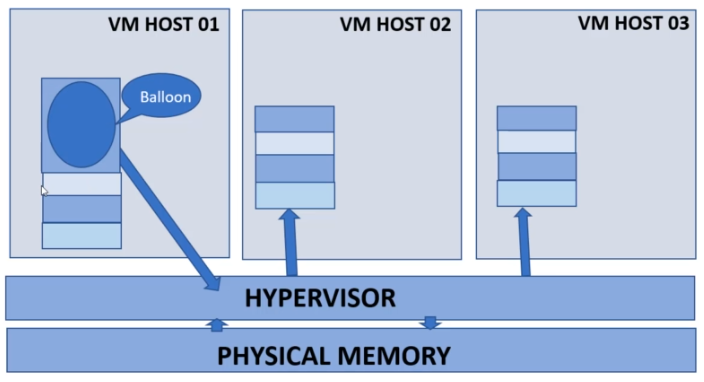

Parâmetros recomendados de Memória
- Não abuse do recurso de memória dinâmica - habilite por VM host
- Cuidado para que _**overcommit e undercommit**_ de memória não impacte a performance

Cuidado com overcommit de memória no host SQL Server
- Overcommit permite alocar mais memória para a VM do que existe fisicamente no host

Parâmetros recomendados de Memória
- Reserve memória mínima para o servidor de Banco de Dados, se possível
- Configurar prioridade de memória para VMs críticas

Configurações essenciais de performance
- Considerar a opção de não utilizar memória dinâmica, mas fixa para servidor de Banco de Dados

Devemos tentar evitar memory paging a todo custo
- Configurar o memory reserved com o mesmo tamanho do parâmetro memory provisioned
- Desabilite o parâmetro de memory ballooning

## Reforçando os conceitos

### Memory Swapping
**Memory swapping** ocorre quando o sistema operacional move páginas de memória da RAM para o disco (swap file) para liberar espaço na memória física. Isso pode acontecer quando a demanda de memória excede a quantidade de RAM disponível. Embora o swapping permita que o sistema continue funcionando, ele pode causar uma degradação significativa no desempenho, pois o acesso ao disco é muito mais lento que o acesso à RAM².

### Memory Ballooning
**Memory ballooning** é uma técnica usada em ambientes virtualizados para gerenciar a memória de forma mais eficiente. Um driver especial, chamado de "balloon driver", é instalado na máquina virtual (VM). Quando o host precisa de mais memória, o balloon driver "infla", solicitando memória da VM, que então libera essa memória de volta para o host. Isso ajuda a evitar o uso excessivo de swap, mas pode impactar o desempenho da VM se não for gerenciado corretamente².

### Overcommit
**Overcommit** refere-se à prática de alocar mais memória virtual para as VMs do que a memória física disponível no host. Isso é possível porque nem todas as VMs usam toda a memória alocada ao mesmo tempo. No entanto, se todas as VMs tentarem usar sua memória máxima simultaneamente, o host pode ficar sem memória, levando a swapping e degradação de desempenho².

### Relação com SQL Server
No contexto do SQL Server, esses conceitos são importantes para entender como a memória é gerenciada em ambientes virtualizados:

- **Swapping**: Deve ser minimizado, pois pode causar lentidão significativa nas operações do SQL Server.
- **Ballooning**: Pode ser útil para liberar memória em situações de alta demanda, mas deve ser monitorado para evitar impactos negativos no desempenho do SQL Server.
- **Overcommit**: Permite uma utilização mais eficiente dos recursos de memória, mas requer um monitoramento cuidadoso para evitar problemas de desempenho devido à falta de memória física.

### Cuidados Adicionais
- **Monitoramento Contínuo**: Use ferramentas de monitoramento para acompanhar o uso de memória e identificar problemas de swapping ou ballooning.
- **Configurações Adequadas**: Configure limites de memória apropriados para o SQL Server e as VMs para evitar overcommit excessivo.
- **Planejamento de Capacidade**: Planeje a capacidade de memória com base nas necessidades reais de uso para minimizar os riscos associados ao overcommit.

---

## Storage - Como definir o melhor modelo de Armazenamento de Dados e Tecnologia

Sub-sistemas de maior impacto na performance
- Disco Rígido

Tipos mais comuns de Disco Rígido

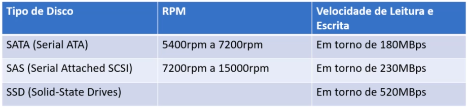

Tipos mais comuns de Array de Discos (RAID)

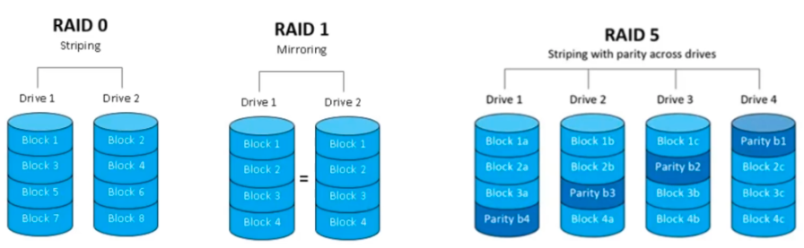

**RAID 0**

- Mínimo de 2 discos
- Dados são distribuidos entre eles (stripping)
- Ótimo desempenho para leitura/escrita
- Baixo nível de segurança dos dados (não recomendado para aplicações críticas)

**RAID 1**

- Mínimo de 2 discos
- Dados são espelhados
- Ótimo desempenho para leitura, baixo para escrita
- Perda de espaço em disco devido ao espelhamento
- Alto nível de segurança dos dados

**RAID 5**

- Mínimo de 3 discos
- Paridade permite reconstruir dados perdidos de um disco
- Bom desempenho para escrita/leitura, sendo melhor para leitura

**RAID 10**

- RAID 1 + RAID 0
- Mínimo de 4 discos
- Pode suportar perda de mais de 1 disco
- Maior performance de escrita e leitura mantendo boa redundância
- Altamente recomendado para aplicações críticas

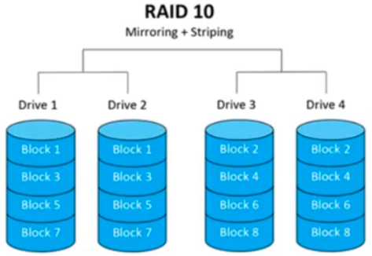

**Tipos mais comuns de Tier**

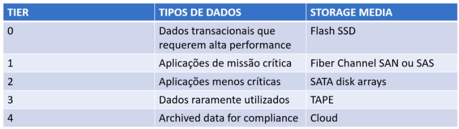

**Ilustração de configuração de uma Storage Area Networks (SAN)**

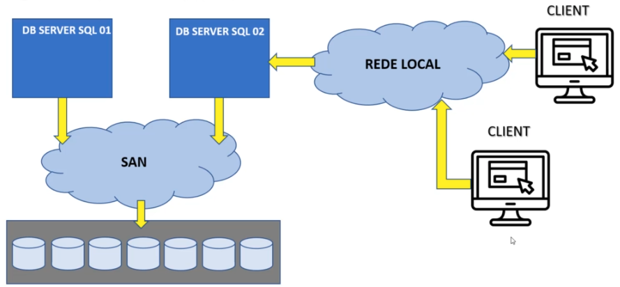

**Conectando todas estas tecnologias e vizualizando dentro da VM**

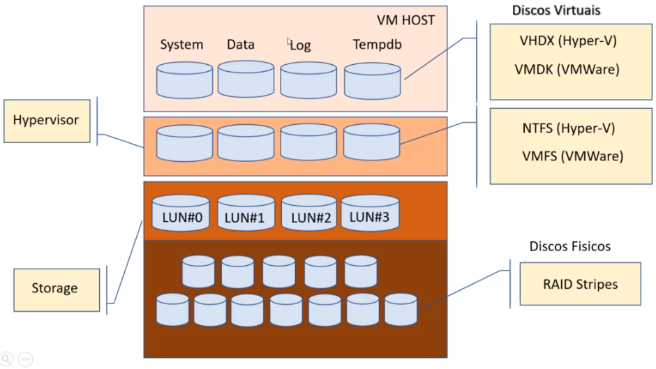

Utilização otimizada do Storage para melhor performance do Banco de Dados
- RAID 10 para Dados, Logs e Tempdb
- Dados, Logs e Tempdb em VMDKs/VHDXs separados
- Mapeamento 1:1 entre VMDKs e LUN
- Utilizar SAS SSD drives sempre que possível
- Desabilitar deduplicação e compressão para Banco de Dados críticos em escrita (OLTP)
    - **Deduplicação**: busca eliminar dados redundantes, criando ponteiros para representá-los
    - **Compressão**: elimina informação desnecessária para representar o dado
- Cuidado com operações de Snapshots, pois podem impactar na performance

Exemplo de Deduplicação

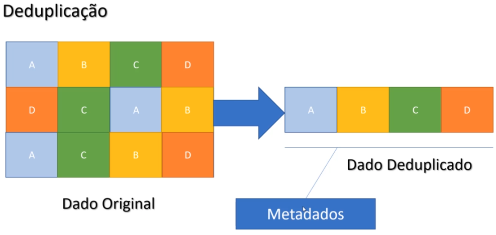

Exemplo de Compressão

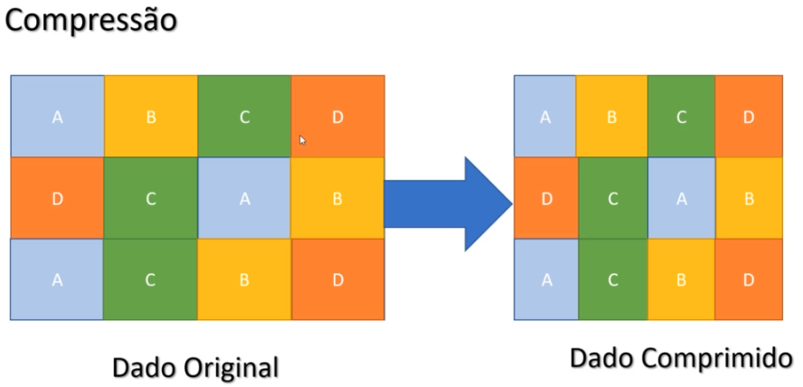

## IO: Como configurar os Discos para turbinar a Transferência de Dados

**Visão do conceito de VSS (Volume Shadow Copy Service)**

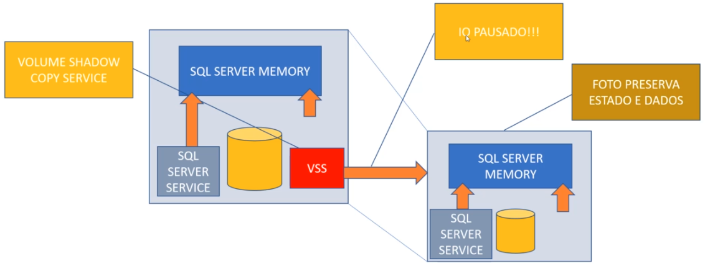

O VSS é um serviço que roda em Backgroud e quando inicializado, cria um Snapshot do estado atual da máquina, neste momento o IO é pausado, provocando uma latência no SQL Server naquele momento, desta forma torna-se importante saber quando é rodado e qual sua frequência, para saber se está dentro da janela de manutenção definida, minimizando seus impactos.

**Alinhamento de Partições**

- O desalinhamento de partições causa degradação de performance no nível de IO
- Discos propriamente alinhados podem significar ganho de até 30% na performance


Parâmetros a serem verificados:
- O valor padrão ideal de **StartingOffset** é de 1024KB (mostrado como 1048576 bytes no sistema)
- O valor de Allocation Unit (bytes per Cluster): 64KB (recomendado pela Microsoft)

**Exercício: Como verificar se as partições estão alinhadas corretamente**

- **Opção 1**
    - Ferramenta: System Information
    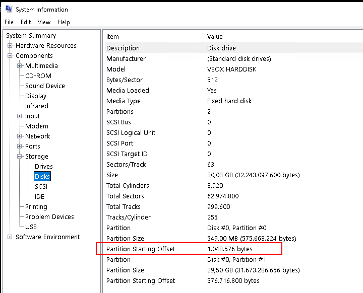

- **Opção 2**
    - Abra um prompt de comando como administrador e digite:

```
Wmic partition get Blocksize, StartingOffset, Name, Index
```

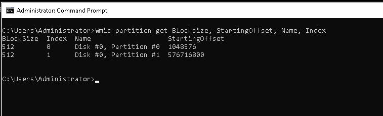

- **Verificar o tamanho do bloco de dados**:
    - Abra um prompt de comando como administrador e digite

```
FSutil FSinfo NTFSinfo <drive>
```
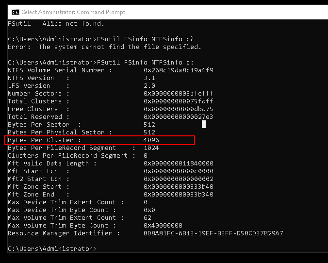

Neste exemplo observamos que o valor está definido em blocos de 4k (4096 bytes), não sendo o valor ideal para diretórios onde estão armazenados arquivos de Banco de Dados.

O valor observado em "**Partition_StartingOffset**" ao ser dividido por 1048576 deve retornar um valor "**Inteiro**", para garantir que as Partições estejam alinhadas. Caso o valor seja um número "**Qebrado**", recomenda-se a correção do alinhamento. Lembre-se:
- Estas correções devem ser feitas pelo Administrador do Sistema
- CUIDADO: as partições terão que ser recriadas e reformatadas, lembre-se de fazer Backup antes do realizar o procedimento

## Performance no Nível do Sistema Operacional: Power Management e Antivírus

### Power Management

Configure o Power Management Plan para o modo "**High Performance**", que pode ser configurado tanto no nível da BIOS como do Sistema Operacional.

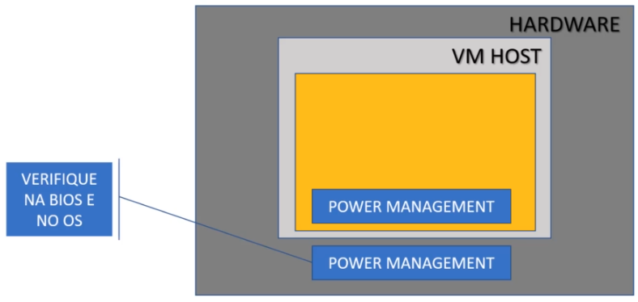

**Exercício: Verificar/Ajustar configuração do power management plan (nível SO)**

- Em Control Panel, localize por System and Security, em seguida por Power Options, certifique-se que a opção "**High Performace**" esteja marcada (ver exemplo abaixo)

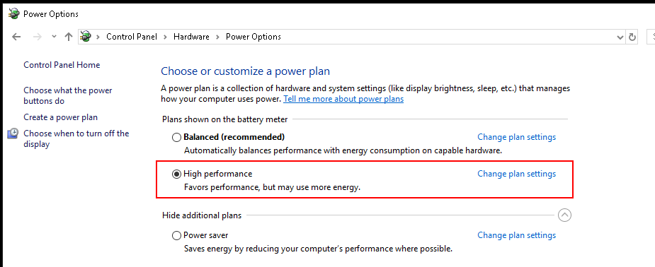

### Antivírus

Caso o Servidor de Banco de Dados tenha um Antivírus instalado, cuide para que diretórios de Bancod de Dados e Serviços do SQL Server estejam como exceções.

Na imagem abaixo encontramos as definições dos arquivos de dados e logs do SQL Server, para servir de referência:

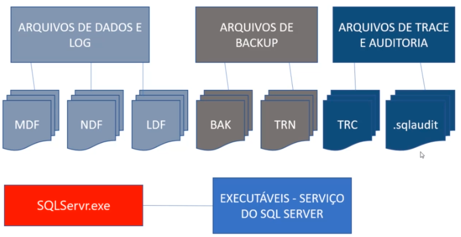

## Ajustes de Performance no nível do Sistema Operacional: Memória, Disco e Rede

### Placa de Rede

Configure o parâmetro "**Receive Side Scalling (RSS)**" para "**Enable**", ele permite distribuir o tráfego de dados que chega pela placa de rede entre múltiplas CPUs, por padrão este parâmetro poderá estar desabilitado. Na ilustração abaixo observamos o que acontece quando ele está ou não habilitado.

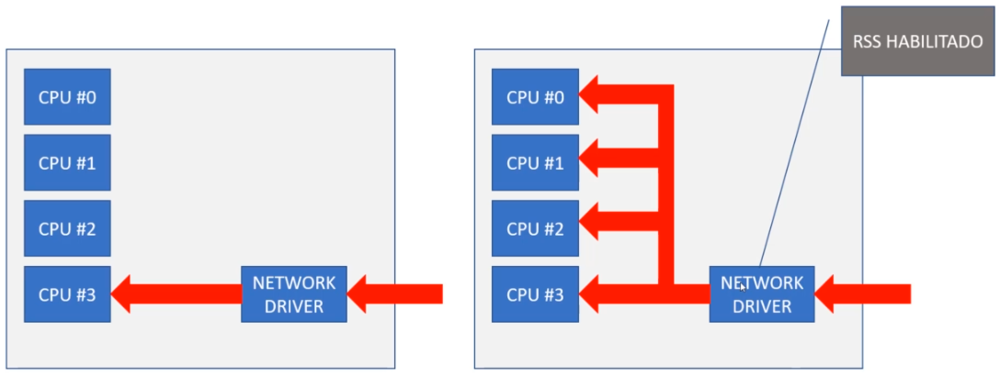

**Exercício: Verificar se o Receive Side Scaling (RSS) está habilitado na interface de rede**

- Em Control Panel, localize por Network and Internet, em seguida clique em Network and Sharing Center, do lado esquerdo clique em Change adapter settings, em seguida clique com o botão direito sobre a placa de rede e selecione Properties e clique no botão Configure, selecione a Guia Advanced e procure por "**Receive Side Scaling**" e altere para "**Enable**", caso não esteja com este valor. Na figura abaixo podemos observar que este parâmetro está desabilitado:

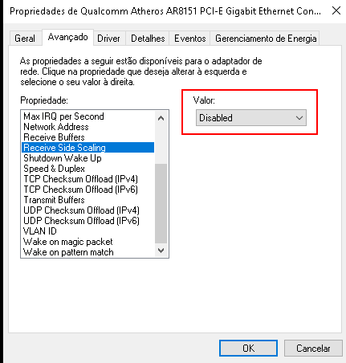