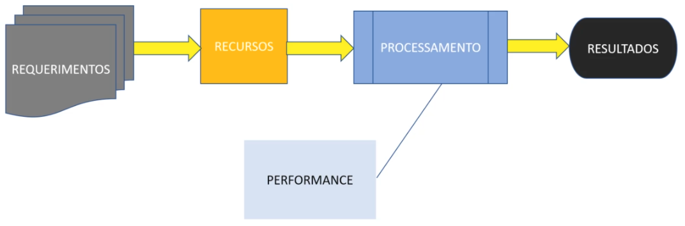
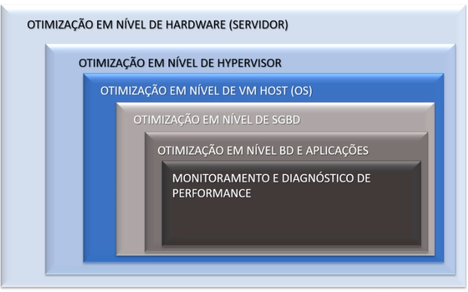

# Udemy - Performance Total no SQL Server

### **Instrutor**: Vínicius Nogueira
### **Linkedin**: [Perfil do LinkeIn](https://www.linkedin.com/in/viniciusnogueira/)
### **Página do curso na Udemy**: [Link para página do curso na Udemy](https://www.udemy.com/course/performance-total-no-sql-server/learn/lecture/26043050?start=0#overview)
### **Pasta de apoio ao  Treinamento no Google Drive**: [Link para pasta do curso no Google Drive](https://drive.google.com/drive/folders/1DzaUlE7JZ8Sjoir8pWCLPQak6zVjqMDm?usp=drive_link)
### **Início**: 03/09/2024
### **Término**: 

## A Jornada

Me considerando um Administrador de Banco de Dados com muitos anos de experiência em Gestão e Administração de ambientes SQL Server, tenho uma grande deficiência quando o assunto é Performance e Tuning e para mudar o jogo, estou iniciando uma longa jornada com intuito de sanar esta deficiência e deixarei aqui meus registros desta caminhada.

## Índice
- [Seção 1: Visão Geral do Curso Performance Total no SQL Server](#seção-1-visão-geral-do-curso-performance-total-no-sql-server)
- [Seção 2: Preparação do Laboratório](#seção-2-preparação-do-laboratório)
- [Seção 3: Onde o Seviço do Banco de Dados está Instalado](#seção-3-onde-o-serviço-do-banco-de-dados-está-instalado)
- [Seção 4: Como o Serviço do Banco de Dados está Instalado](#seção-4-como-o-serviço-do-banco-de-dados-está-instalado)
- [Seção 5: Como o Serviço do Banco de Dados é Acessado pelos Usuários e Aplicações](#seção-5-como-o-serviço-do-banco-de-dados-é-acessado-pelos-usuários-e-aplicações)
- [Lições Aprendidas](#lições-aprendidas)

---

## Dia 1

---

## Seção 1: Visão Geral do Curso Performance Total no SQL Server

### Visão Geral do Curso

### Introdução

A performance de um sistema é crucial para garantir que as tarefas sejam executadas dentro de um tempo aceitável, proporcionando uma boa experiência ao usuário e mantendo a produtividade. No entanto, problemas de performance podem afetar empresas de todos os tamanhos, desde pequenas startups até grandes corporações. Vamos explorar alguns dos principais desafios de performance encontrados em ambientes de produção:

- **Negligência Inicial**: A performance é frequentemente deixada de lado durante as fases iniciais de desenvolvimento. Isso ocorre porque o foco está em entregar funcionalidades, e a performance só é considerada quando os problemas já estão impactando os usuários finais.
  
- **Custo Elevado de Correção**: Resolver problemas de performance em produção é significativamente mais caro e complexo. Muitas vezes, esses problemas estão relacionados a questões básicas de design e estrutura do aplicativo, que poderiam ter sido evitadas com uma abordagem proativa.

- **Falta de Especialização**: Muitas empresas não possuem um DBA (Administrador de Banco de Dados) dedicado ao desenvolvimento do sistema. Isso resulta em uma falta de foco na otimização de performance desde o início do ciclo de desenvolvimento.

- **Análise de Requisitos e Testes**: Embora seja comum realizar uma boa análise de requisitos e testes, esses processos frequentemente não levam em conta cenários realistas de carga e uso. Isso resulta em sistemas que funcionam bem em ambientes de teste, mas falham em produção.

- **Indisponibilidade e Impacto no Negócio**: A solução de problemas de performance geralmente ocorre quando o sistema já está em uso, o que pode causar indisponibilidade e impactar negativamente o negócio. Problemas de performance podem levar a tempos de resposta lentos, insatisfação dos usuários e perda de produtividade.

- **Questões de Design e Estrutura**: Muitos problemas de performance são decorrentes de decisões de design e estrutura inadequadas. Isso inclui a falta de índices apropriados, consultas SQL ineficientes e uma arquitetura de banco de dados mal planejada.

Para enfrentar esses desafios, é essencial adotar uma visão holística de performance, que inclua:

1. **Planejamento Proativo**: Considerar a performance desde as fases iniciais de planejamento e design do sistema.
2. **Testes Realistas**: Realizar testes de carga e stress que simulem cenários reais de uso.
3. **Monitoramento Contínuo**: Implementar ferramentas de monitoramento para identificar e resolver problemas de performance antes que eles impactem os usuários finais.
4. **Otimização Contínua**: Revisar e otimizar regularmente o design do banco de dados, as consultas SQL e a infraestrutura subjacente.
5. **Capacitação da Equipe**: Investir na capacitação da equipe de desenvolvimento e operações para que todos estejam cientes das melhores práticas de performance.

Com essa abordagem, é possível minimizar os problemas de performance e garantir que o sistema funcione de maneira eficiente e confiável, proporcionando uma melhor experiência para os usuários e suportando o crescimento do negócio. Nosso treinamento terá como foco principal a **Performance**, abordando todas essas áreas para garantir um entendimento completo e prático do assunto.

#### SQL Server - Performance

No ciclo comum de desenvolvimento de uma aplicação, a performance normalmente é observada na fase de Processamento, onde são feitos testes, QA estressa a aplicação e, com base nos resultados, são feitas avaliações de performance. No entanto, isso deveria ser visto ainda na fase de Recursos.

Não basta aumentarmos os recursos de máquina e acharmos que isso irá resolver os problemas de performance; precisamos identificar os gargalos do nosso sistema.

O que costuma acontecer:

- Problemas de performance e procrastinação andam de mãos dadas.
- Ocorrem de forma lenta e gradativa, aumentando o nível de insatisfação dos usuários e diminuindo a produtividade.

Problemas de performance são os mais comuns e duradouros em sistemas de qualquer empresa, pois, na maioria dos casos, eles não impedem a utilização total do sistema, fazendo com que as pessoas demorem mais para reagir a esse problema.

Iniciaremos nossa jornada respondendo a estas questões:

1. **Onde** o servidor de banco de dados está instalado?
2. **Como** o servidor de banco de dados está instalado?
3. **Como** o servidor de banco de dados é acessado pelos usuários/aplicações?
4. **Como** o servidor de banco de dados é monitorado e mantido?

Passaremos pelos seguintes níveis de análise:

- Otimização em nível de hardware (servidor)
- Otimização em nível de hypervisor
- Otimização em nível de VM host (OS)
- Otimização em nível de SGBD
- Otimização em nível de banco de dados e aplicações
- Monitoramento e diagnóstico de performance

## Seção 2: Preparação do Laboratório

### Como será nosso Laboratório de Treinamento

#### Para nosso Laboratório faremos uso de VMs e para tanto podemos escolher entre as seguintes opções:

1. vmware - [Link para página de Download do vmware](https://access.broadcom.com/default/ui/v1/signin/)
2. VirtualBox - [Link para página de Download do VirtualBox](https://www.virtualbox.org/wiki/Downloads)
3. Vagrant - [Link para página de Download do Vagrant](https://developer.hashicorp.com/vagrant/install)

#### Para o servidor onde o SQL Server irá rodar utilizaremos a seguinte opção:

1. Windows Server 2019 Evaluation Edition [Link para página de Download do Windows Server 2019](https://info.microsoft.com/ww-landing-windows-server-2019.html?lcid=pt-BR)

#### Para o ambiente do SQL Server precisaremos dos seguintes itens:

1. SQL Server 2019 Developer Edition [Link para página de Download do SQL Server 2019](https://info.microsoft.com/ww-landing-sql-server-2019.html?lcid=pt-BR)
2. SQL Server Management Studio (SSMS) [Link para página de Download do SQL Server Management Studio](https://learn.microsoft.com/pt-br/sql/ssms/download-sql-server-management-studio-ssms?view=sql-server-ver15)
3. Banco de Dados de Exemplo (AdventureWorks sample database) [Link para página de Download do Banco de Dados de Exemplo](https://github.com/Microsoft/sql-server-samples/releases/tag/wide-world-importers-v1.0) **Obs.**: _Escolha por WideWorldImporters-Full.bak_

### Montagem do Laboratório de Treinamento

#### Configurando a máquina Virtual

Optamos por usar o **VirtualBox** e vamos criar uma VM com as seguintes características:

**Servidor Windows Server 2019 (1 VM):**

- **Nome da VM:** `LAB-DB-VM01`
- **Memória RAM:** 2GB
- **CPU:** 2 núcleos (ajustável)
- **Disco:** 30GB (ou mais conforme necessário)
- **Rede:**
  - Modo de rede: **Bridge**
  - IP: **192.168.0.103**
  - Gateway: **192.168.0.1**
  - DNS: **192.168.0.1 8.8.8.8**
- **Função no laboratório:** Servidor SQL Server.

Após criar a VM, iremos fazer a instalação do Sistema Operacional escolhido (Windows Server 2019 Evaluation Edition), com as seguintes características:

- **Language to install**: English (United States)
- **Time and currency format**: English (United States)
- **Keyboard or input method**: US
- **Operating system**: Windows Server 2019 Standard Evaluation (Desktop Experience)
- **Which type of installation do you want**: Custom: Install Windows only (advanced)
- **Customize settings**:
  - **User name**: Administrator
  - **Password**: Minh@Senh@123